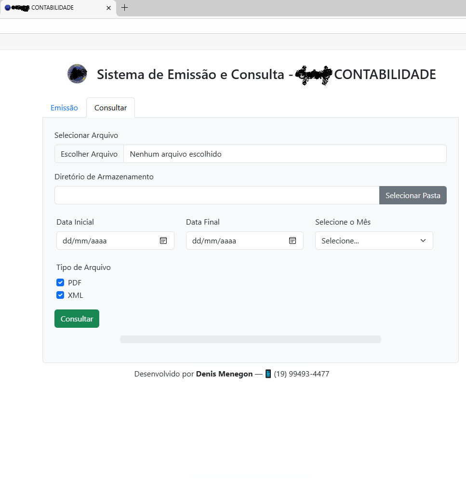

🛠 Tecnologias Utilizadas
HTML

Bootstrap

Python

Playwright + Playwright-Stealth

Pandas

Flask

PyInstaller

🚀 Principais Funcionalidades

Leitura automática de dados de planilhas

Automação Web com Playwright (consulta e emissão fiscal)

Download automático e organizado de PDF e XML

Execução agendada ou sob demanda

Interface e distribuição facilitada via executável .exe

🖥️ UI - Telas do Aplicativo
Construída com o framework web Flask, HTML e Bootstrap, a Interface Gráfica de Usuário (GUI) permite ao usuário realizar as ações de emissão e consulta. Seus elementos de interface são otimizados para oferecer uma experiência fluida no acesso a essas duas funcionalidades principais.

Estrutura da Planilha .xlsx

Tela de Emissão e Consulta

✅ Resultados Obtidos

Eliminação de falhas manuais

Aumento significativo da produtividade

Maior agilidade no processo fiscal

Organização padronizada de documentos
